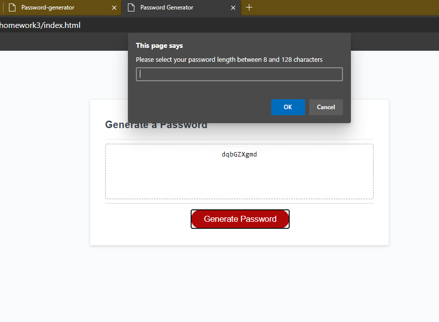

## 03 JavaScript: Password Generator

# User will click "Generate password" button to open prompt for password length
# If parameters are not met, function will return
# User will be asked to confirm use of uppercase and lowercase letters, numbers, and special characters.
# If parameters are not met, function will return

# If enough parameters are met, a password will be generated meeting user-selected criteria

REPO: https://github.com/kate-ak/homework3
INDEX: https://kate-ak.github.io/homework3/

The following image demonstrates the application functionality:

